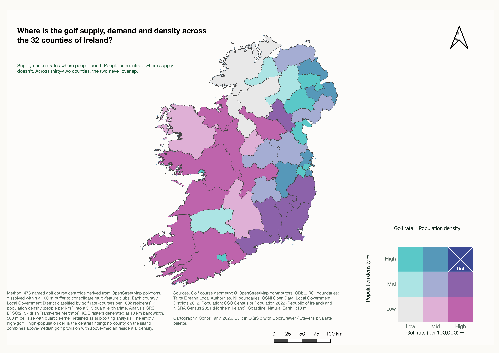

# Where is the golf supply, demand and density across the 32 counties of Ireland?

A bivariate spatial analysis of golf course provision and population density across the island of Ireland — 32 counties, both Republic of Ireland and Northern Ireland.

**[🗺 Live interactive map →](https://conorfahy99.github.io/Golf-Heatmap-Ireland/)**

## The finding

Across 42 jurisdictions (31 ROI Local Authorities + 11 NI Local Government Districts) classified into a 3×3 quantile grid by golf rate (courses per 100,000 residents) and population density (people per km²), **eight of the nine cells are populated — the "high golf × high population" cell is empty.**

No county on the island combines above-median golf provision with above-median population density. Supply concentrates in rural coastal-tourism and inland market-town counties (Wicklow, Carlow, Cork County, Sligo, Kerry). Demand concentrates in urban Local Authorities where there's no land for new courses (Dublin City, Belfast, Cork City). The two never overlap.

## Data

| Layer | Source |
|---|---|
| Golf courses (473 cleaned centroids) | OpenStreetMap, `leisure=golf_course` (Geofabrik snapshot) |
| ROI Local Authority boundaries | Tailte Éireann |
| NI Local Government District boundaries | OSNI Open Data (2012 LGDs) |
| ROI population | CSO Census of Population 2022 |
| NI population | NISRA Census 2021 |

## Method

- **Analysis CRS:** EPSG:2157 (Irish Transverse Mercator). Web Mercator's ~2.8× area inflation at 53°N makes it unsuitable for density work.
- **Course cleaning:** Started with 648 OSM `golf_course` polygons. Dropped 122 unnamed features. Buffered remaining polygons by 100m and dissolved overlaps to consolidate multi-polygon clubs into single features. Final count: 473.
- **Bivariate construction:** Each county classified by `per_100k` (golf rate) and `pop_density` (people per km²) into 3 quantile bins each, combined into a 1–9 bivariate index using `(pop_class - 1) × 3 + golf_class`.
- **Cartography:** Stevens 3×3 teal × magenta palette. Cool teals encode high population, warm magentas encode high golf provision, deep purple/blue encodes both. The empty top-right cell is rendered with a diagonal cross to surface the structural finding visually.

## Stack

QGIS 3 (Refactor Fields, Reclassify by Table, Join Attributes by Nearest, Print Composer), PyQGIS console scripts, ColorBrewer + Stevens palettes, GeoJSON (simplified Douglas-Peucker from 2.2M to 156k vertices), Leaflet, CartoDB Positron basemap, vanilla JS.

## Repository contents

- [`index.html`](index.html) — interactive web map
- [`data/counties.geojson`](data/counties.geojson) — 42-feature choropleth layer with all derived stats
- [`data/courses.geojson`](data/courses.geojson) — 473 cleaned course centroids
- [`preview.png`](preview.png) — hero static map (A3, 300 DPI)

Full case study, methodology document, QGIS workbook and reproducibility files are in the parent project directory.

## Author

Conor Fahy · 2026 · GIS analyst, Dublin / London
